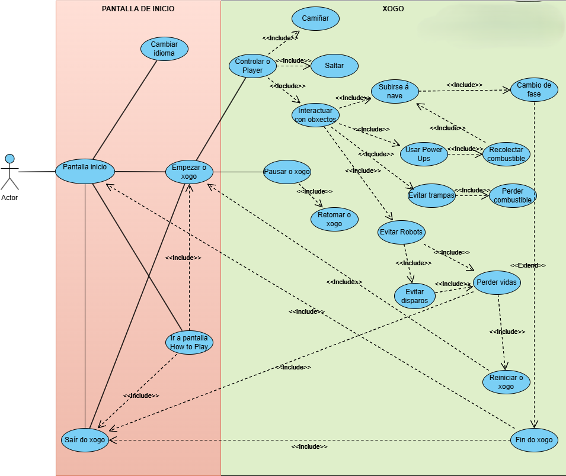

# Pantalla de inicio
## Casos de uso:

* **Ir á pantalla How to Play**:
  - Relación directa co Actor: Permite ao xogador acceder ás instruccións do xogo.
  - Dende aquí, pode:
    - **&lt;&lt;include&gt;&gt; Sair do xogo**: O xogador pode abandonar o xogo dende esta pantalla.
    - **&lt;&lt;include&gt;&gt; Empezar xogo**: O xogador pode iniciar a partida dende esta pantalla.

* **Cambiar idioma**:
  - Relación directa co Actor: Permite configurar o idioma antes de comezar o xogo.

* **Empezar xogo**:
  - Relación directa co Actor: Activa a lóxica do xogo e permite ao xogador controlar á personaxe.

* **Sair do xogo**:
  - Relación directa co Actor: Opción para pechar o xogo dende a pantalla inicial.

---

# Empezar xogo
## Casos de uso:

* **Controlar ao Player**:
  - **&lt;&lt;include&gt;&gt; Caminar**: Movemento básico do xogador.
  - **&lt;&lt;include&gt;&gt; Saltar**: Permite esquivar obstáculos.
  - **&lt;&lt;include&gt;&gt; Interactuar con obxectos**: Permite ao xogador interactuar cos elementos do escenario.

* **Pausar o xogo**:
  - **&lt;&lt;include&gt;&gt; Retomar o xogo**: Permite ao xogador continuar a partida despois de pausala.

* **Sair do xogo**:
  - Relación directa: Opción para abandonar a partida.

---

# Interactuar con obxectos
## Casos de uso:

* **Usar Power-ups**:
  - **&lt;&lt;include&gt;&gt; Recolectar combustible**: Recolectar combustible é necesario para avanzar ao seguinte nivel. Os power-ups sempre otorgan combustible.

* **Evitar trampas**:
  - **&lt;&lt;include&gt;&gt; Perder combustible**: Se o xogador falla ao esquivar trampas, perde combustible acumulado.

* **Evitar robots**:
  - **&lt;&lt;include&gt;&gt; Perder vidas**: Se o xogador choca cun robot ou co seu disparo, perde unha vida.
    - **Evitar disparos**:
      - **Perder vidas**:
        - **&lt;&lt;include&gt;&gt; Relación directa**: Non esquivar disparos de robots fai que o xogador perda unha vida.

* **Subirse á nave**:
  - **&lt;&lt;include&gt;&gt; Recolectar combustible**: Subirse á nave require combustible suficiente.
  - **&lt;&lt;include&gt;&gt; Cambio de fase**: Ao subirse á nave, o xogador avanza á seguinte fase.

* **Cambio de fase**:
  - **&lt;&lt;extend&gt;&gt; Fin do xogo**: Fin do xogo ocorre unicamente se o cambio de fase corresponde á última fase do xogo.

---

# Perder vidas
## Casos de uso:

* **Reiniciar o xogo**:
  - Permite ao xogador volver a intentar tras un **Game Over**.
  
* **Sair do xogo**:
  - Opción para abandonar o xogo tras perder todas as vidas.

---

# Fin do xogo
## Casos de uso:

* **&lt;&lt;extend&gt;&gt; Cambio de fase**:
  - Fin do xogo só ocorre se o cambio de fase corresponde á última fase.

* **Pantalla de inicio**:
  - Dende Fin do xogo, o xogador pode volver á pantalla inicial para reiniciar o xogo.

* **Sair xogo**:
  - Opción para pechar o xogo tras finalizar.